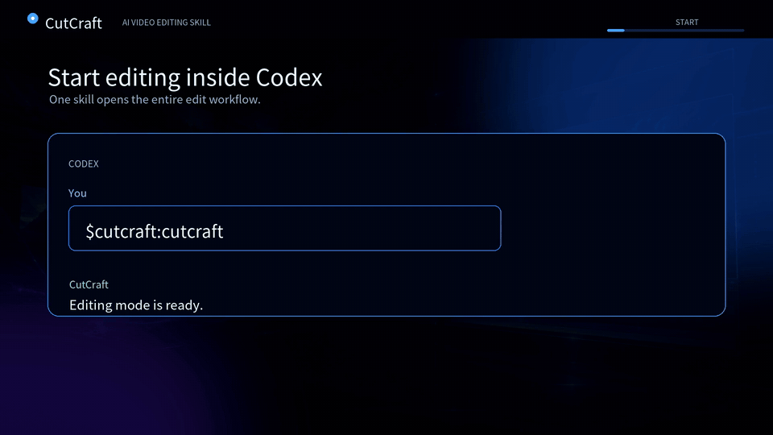

# CutCraft

> **The most complete AI video-editing skill for Codex.**
>
> One conversation in. One finished film out.

CutCraft is built for the moment people realize AI should do more than generate a rough cut or burn in captions. It is an open-source editing production system that takes ownership of the full job: understand the footage, lock the creative direction, make the edit, finish the sound and picture, verify the export, and leave you with one obvious final file.

**It is not another “one trick” skill.** It does not stop after transcription, captions, a highlight reel, or a pile of unnamed renders. CutCraft turns a conversation into a controlled, resumable editing workflow—without making you bounce between a timeline, a browser editor, five export folders, and a dozen half-finished files.

> **中文一句話：** CutCraft 不是只會上字幕的 skill。它把「看素材、問風格、找重點、剪節奏、做轉場、配音樂、上字幕、驗成片、留好可改的過程」整條剪輯工作流搬進 Codex。你保留創意決定；它接手最耗時間的繁瑣。

## Watch it work

[](assets/demo/CutCraft_English_Promo.mp4)

**Click the preview for the full 30-second English product film with sound.** The GIF is deliberately compact for the README; the complete 1080p video is included in this repository.

## Why CutCraft feels different

Most AI editing tools solve one step. CutCraft is designed to own the production chain.

| Typical single-purpose skill | CutCraft |
| --- | --- |
| Produces a transcript, a caption file, a summary, or one clip | Produces a complete, reviewable video edit with a clear final delivery |
| Re-asks taste questions while it works | Collects the important decisions once, with recommended defaults |
| Makes style choices invisible | Shows real visual subtitle, size, placement, music, and effects choices before the first cut |
| Leaves behind a maze of exports | Keeps one obvious `成品/` final and a traceable `過程/` for every revision |
| Treats corrections as a re-do | Lets you correct a transcript cue, preserve timing, and re-render immediately |
| Uses assets without a paper trail | Fails closed on asset provenance, licensing, attribution, and checksums |
| Calls a render “done” when FFmpeg exits | Runs media diagnostics, quality checks, and visual/listening review before delivery |

That is the difference between an AI feature and an AI editor. CutCraft has the taste checkpoint, the editing intelligence, the project memory, and the delivery discipline required to make a real video project feel finished.

## What CutCraft can finish

- **Story and selection:** inspect footage, compare takes, find scenes, silence, black frames, freezes, and edit points.
- **Creative control:** ask once about platform, aspect ratio, pace, grading, reframing, transitions, effects, audio, captions, B-roll, privacy, and the things that are forbidden.
- **Precision edits:** cut from word-level transcripts without cutting through words; keep a transcript correction loop for instant, timing-safe fixes.
- **Full post-production:** cuts, reframing, color treatment, overlays, transitions, effects, music, SFX, captions, and final loudness normalization.
- **Trustworthy delivery:** keep asset provenance, preserve every editable decision, validate the project, inspect the render, and export one clearly named final video.

## From a sentence to a finished film

1. Invoke `$cutcraft:cutcraft` and describe the video you want.
2. CutCraft inventories the material and reads the footage before it starts editing.
3. It shows the creative choices visually—caption treatment, size, placement, music, effects, and delivery shape—then asks for one consolidated approval. `全部用建議值` is a valid answer.
4. It creates a reproducible EDL, cuts from originals, and builds the complete picture and sound.
5. If a line is wrong, say which cue to change. CutCraft updates the transcript, preserves timing, and applies the correction back to the film.
6. It verifies the output and leaves exactly one final in `成品/`; the sources, clips, EDLs, reports, and audit trail stay organized in `過程/`.

There is deliberately no browser front end pretending to be an editor. The interface is the conversation; the proof is the render.

## Install

Clone the repository and install its Python environment:

```bash
git clone <repository-url> ~/Developer/cutcraft
cd ~/Developer/cutcraft
uv sync
```

### Codex

Link the canonical skill directory:

```bash
ln -sfn ~/Developer/cutcraft/skills/cutcraft ~/.agents/skills/cutcraft
```

Codex plugin installation uses `.codex-plugin/plugin.json` and discovers `skills/cutcraft` automatically.

### Claude Code — direct `/cutcraft` invocation only

CutCraft is a native **Claude Code** personal skill. It is intentionally not packaged for Claude Chat, and it is not a namespaced plugin command. Install it once:

```bash
./scripts/install-claude-code.sh
```

After that one-time setup, invoke it directly with `/cutcraft` and describe the film you want to make. The installer creates a safe symlink at `~/.claude/skills/cutcraft`, so the command is available from every Claude Code project. Claude Code users get the same workflow, helper scripts, first-use environment checks, project layout, and revision-safe transcript loop as Codex users.

Run `python3 skills/cutcraft/helpers/check_environment.py` after installation to see which optional local tools or credentials you still need.

The first-use checker never installs software or prints secrets. It lists every missing requirement, the official URL, why it is needed, and the exact next step.

## Choose transcription

For ElevenLabs, create a restricted speech-to-text key with a spending limit and save it using hidden input:

```bash
python3 skills/cutcraft/helpers/configure_api_key.py
```

The key is stored at `~/.config/cutcraft/.env` with private permissions, outside the repository and all video projects.

For local transcription on Apple Silicon:

```bash
uv sync --extra local-asr-macos
```

On other supported systems:

```bash
uv sync --extra local-asr
```

Local models are downloaded on first use. CutCraft explains this before starting and never uploads media when `--provider local` is selected.

## Use

Invoke `$cutcraft:cutcraft` in Codex or `/cutcraft` in Claude Code, then provide footage or a source folder. For example:

- `幫我把這些素材剪成 45 秒直式短片並上繁中字幕`
- `剪這段訪談，先讓我挑字幕大小、位置和風格`
- `第 18 句改成「CutCraft」，然後立刻套回影片`

CutCraft inspects and transcribes first, shows the visual choices, then waits for the single approval checkpoint before cutting.

## Project output

```text
~/Documents/Codex/CutCraft/<project>/
├── cutcraft.project.json
├── 成品/
│   ├── <project>_final.mp4
│   ├── <project>_逐字稿.md
│   └── <project>.srt
└── 過程/
    ├── creative_brief.json
    ├── inventory.json
    ├── media_analysis.json
    ├── edl.json
    ├── master.srt
    ├── asset_registry.json
    ├── transcripts/
    ├── proxies/
    ├── clips/
    ├── assets/
    └── verify/
        ├── quality_report.md
        └── quality_report.json
```

Source footage remains in place. `成品/` contains only delivery files; everything needed for cheap, traceable revisions stays in `過程/`.

## Repository layout

```text
.codex-plugin/plugin.json
scripts/install-claude-code.sh  # installs the direct Claude Code /cutcraft command
skills/cutcraft/          # the one canonical installable skill
tests/                    # helper and safety tests
README.md
SECURITY.md
LICENSE
pyproject.toml
uv.lock
```

No API key, model weights, stock media, user footage, transcripts, generated project files, or browser frontend is bundled.

## Acknowledged design influences

CutCraft is an independent implementation. Its research notes credit the official projects that informed its architecture: FFmpeg, LosslessCut, Auto-Editor, PySceneDetect, OpenAI Whisper, WhisperX, FunClip, OpenCut, and Remotion. See `skills/cutcraft/references/competitive-research.md` for the feature-by-feature decisions and links.
